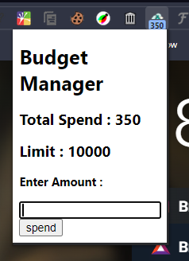
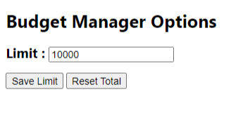
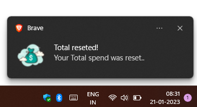
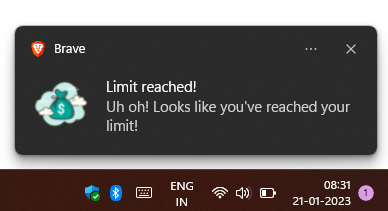
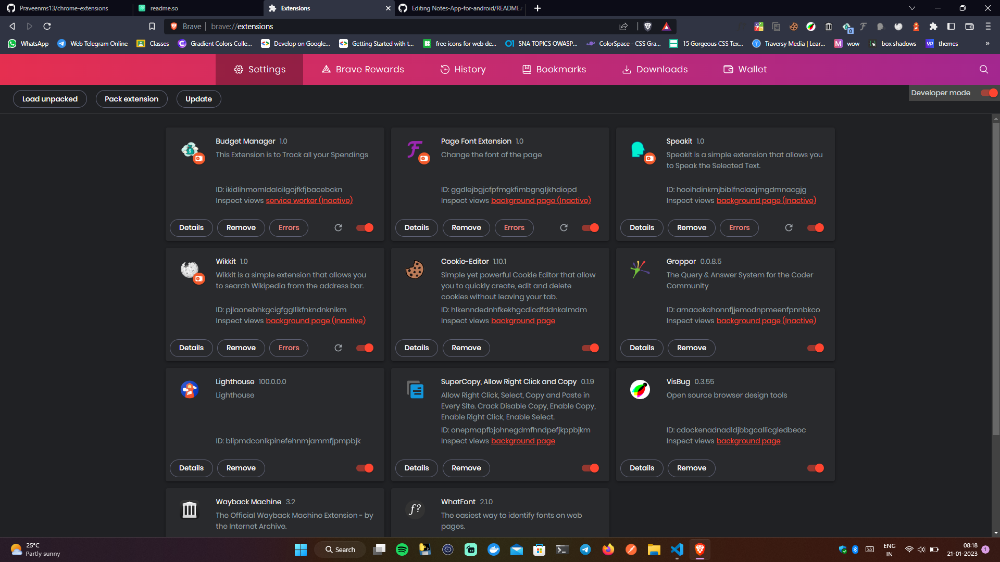

# Chrome Extensions


## Appendix

This repo consist of 4 chrome extensions which is very useful for the everyday users.
## List of Extensions
- Budget Manager
- Page Font Style
- Wikkit - Wikipedia
- Speakit

## Languages Used

Languages used in this project are :

- html
- css
- Javascript, jquery

### About the Extension : 

| Extension name | Description |
| ------ | ------ |
| Budget Manager | This Extension is used to keep track of your online spandings and purchase, after exery spendings you must add the spending amount to this extension or you can just select the amount with the cursor, then right click => the options tab will open => select `add to manager` then the amount will be added to the extension.<br> You can also set Spending Limit in the options menu of this extension, so if you exceeded the limit you'll get the notification, stating that you've exceeded the limit and you can reset the limit or reset the spending amount.    |
| Page Font Style | Something is wrong. Check response for error message. |
| Wikkit | Bad request format or not all attributes are provided. |
| Speakit | Bad request format or not all attributes are provided. |


### To load This extensions to your browser
#### clone this repo : 

```javascript
git@github.com:Praveenms13/chrome-extensions.git
```

#### and go to the default extension page of your website (if you are using other browser means just replace chrome i.e., brave://extension/)
```
chrome://extensions/
```

### You may see this page : 
#### Click "Load Unpacked" which is top left corner and your file system will open, just select the particular extension file and click ok, then you can find it on your browser.




